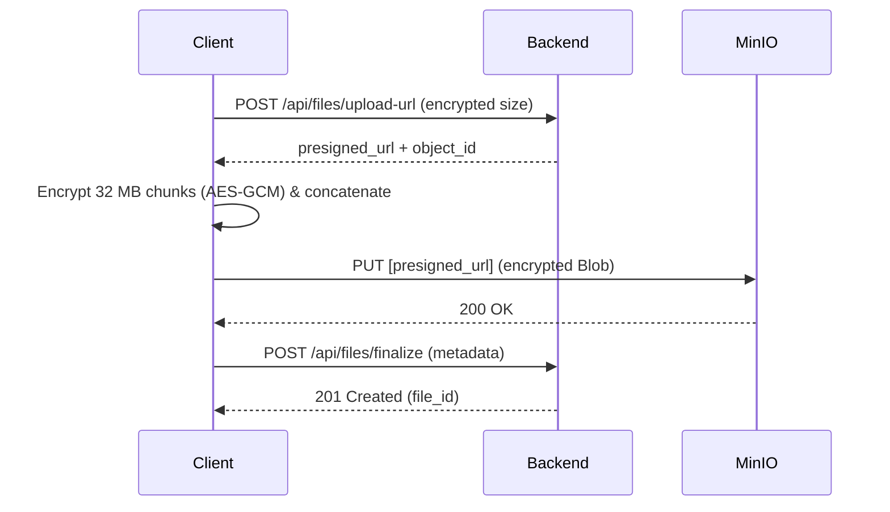
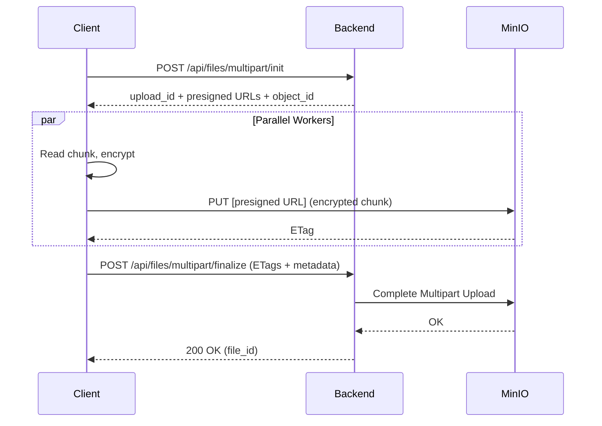

# E2EE (End-to-End Encryption) Architecture

---

## Zero-Knowledge Principles

The platform is designed to guarantee zero-knowledge privacy
- The backend server does not have access to plaintext user passwords.
- The server does not store or process decrypted private keys (user or organization keys).
- Plaintext file contents and original file names are never sent to or stored on the server.
- All cryptographic operations (key generation, encryption, decryption) are performed client-side using the Web Cryptography API.

---

## File Encryption Scheme

### A. Client-Side Pre-Upload Validation
Before encrypting, files are validated in [fileValidation.service.ts](../frontend/src/services/fileValidation.service.ts):
1. **Size check:** Files must not exceed the limit (`MAX_FILE_SIZE = 2 GB` in [uploadConfig.ts](../frontend/src/config/uploadConfig.ts)).
2. **Type verification:** The client reads the first 4100 bytes of the file and uses `file-type` to detect the actual MIME type based on binary signatures.
3. **Extension matching:** The detected MIME type is validated against the allowed types in [mime.types](../frontend/src/config/mime.types). The file extension must match the allowed list for that MIME type.

### B. Encryption Mechanism
When a file is approved for upload:
1. **DEK Generation:** The client generates a random 32-byte Data Encryption Key (DEK) for symmetric encryption.
2. **Base IV Generation:** A random 12-byte initialization vector (IV) is generated.
3. **Metadata Encryption:** The client encrypts the original file name and the DEK using the recipient's RSA public key (the user's own public key for personal files, or the organization's public key for group files) with RSA-OAEP.
4. **IV Derivation per Chunk:**
   To encrypt the file in chunks without reusing IVs, a unique 12-byte IV is derived for each chunk

---

## Upload Flow

Files are uploaded using one of two paths based on file size. The threshold is `MULTIPART_THRESHOLD = 96 MB` (configured in [uploadConfig.ts](../frontend/src/config/uploadConfig.ts)). The upload is managed by [useE2EEUpload.ts](../frontend/src/hooks/useE2EEUpload.ts).

### A. Single PUT Upload (Files $\le$ 96 MB)
1. The client requests a presigned S3/MinIO upload URL from the server, specifying the encrypted file size (original size + 16 bytes overhead per 32 MB chunk for the GCM tag).
2. The client encrypts the file in chunks of 32 MB and concatenates the resulting ciphertexts into a single Blob.
3. The client uploads the encrypted Blob directly to storage using the presigned URL via a HTTP PUT request.
4. The client finalizes the upload by sending the metadata to the backend API (`/api/files/finalize` in [files.go](../backend/storage/internal/handlers/files.go)):
   - `object_id`
   - `encrypted_filename`
   - `encrypted_dek`
   - `iv`

### B. Multipart Parallel Upload (Files $>$ 96 MB)
1. The client initiates a multipart upload via `/api/files/multipart/init`, specifying the number of chunks.
2. The server responds with an `upload_id` and a list of presigned upload URLs (one per chunk).
3. The client uploads chunks in parallel :
   - A chunk is read from the file, encrypted with the DEK and the derived chunk IV, and uploaded to its presigned URL via PUT.
   - The client records the `ETag` returned by the storage server.
4. In case of failure, `/api/files/multipart/abort` is called to clean up storage.
5. Once all chunks are uploaded, the client calls `/api/files/multipart/finalize` with the list of ETags, `encrypted_dek`, `iv`, and `encrypted_filename`. The server asks MinIO to assemble the parts.

---

## Download and Decryption Flow

The decryption process is managed by [useE2EEDownload.ts](../frontend/src/hooks/useE2EEDownload.ts) and [useE2EEPreview.ts](../frontend/src/hooks/useE2EEPreview.ts).

### A. Key Resolution
- **Personal Files:** The client reads the user's RSA private key from IndexedDB.
- **Organization Files:**
  1. The client fetches organization keys from `/api/orgs/:orgId/members/keys`.
  2. The client decrypts the Organization AES Key with the user's private key.
  3. The client decrypts the organization's private key with the AES key. This key is used for file decryption.

### B. Streaming Decryption
1. The client fetches the download URL and metadata from `/api/files/:fileId/download`.
2. The client decrypts the DEK and filename using the active private key.
3. The client requests the encrypted file stream.
4. As the stream is read, data is accumulated in a buffer:
   - When the buffer holds a complete ciphertext chunk (`CIPHER_CHUNK_SIZE = 32 MB + 16 bytes`), the client decrypts it using AES-GCM with the DEK and the derived chunk IV.
5. Saving the file:
   - **Supported browsers:** The client uses the File System Access API (`showSaveFilePicker`) to stream decrypted bytes directly to disk, avoiding high memory utilization.
   - **Fallback (e.g. Firefox):** Decrypted chunks are accumulated as a Blob in memory and downloaded via a temporary object URL.

---
