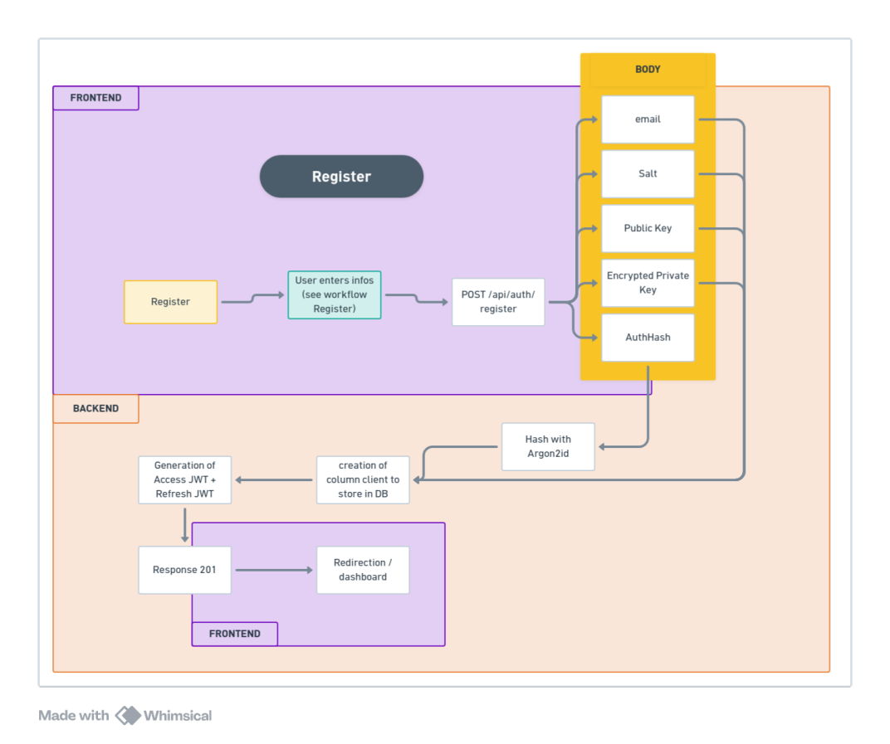
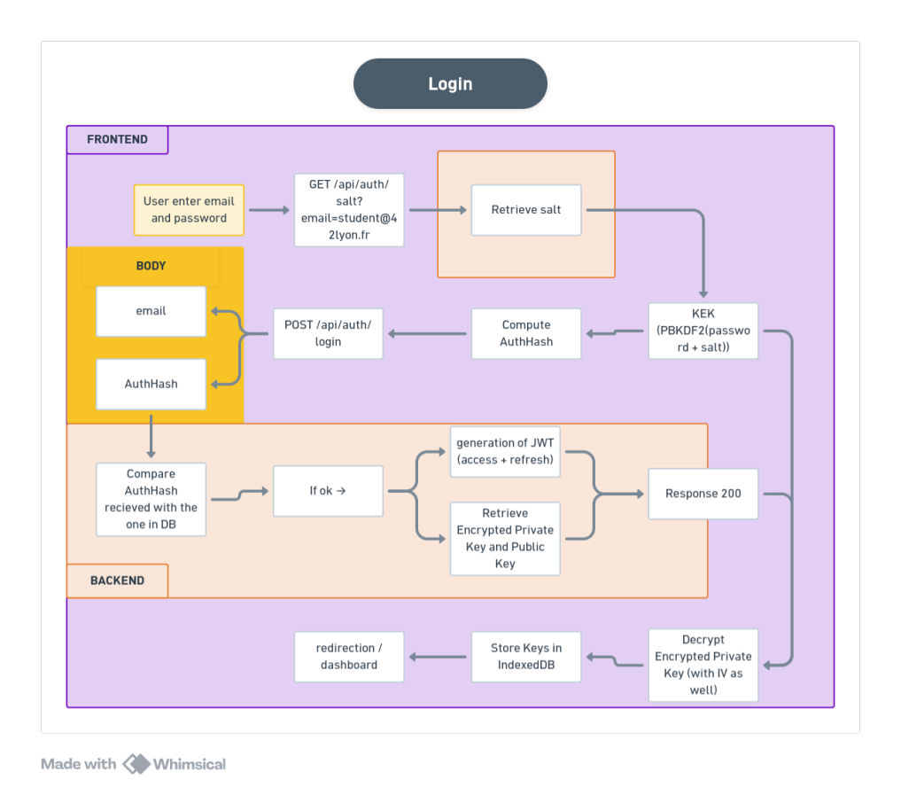

# ostrom - Architecture Zero-Knowledge

Stack: React (Frontend) / Go + GORM (Backend) / PostgreSQL / Redis / MinIO

* **AuthHash Strategy:** Stored securely using the `Argon2id` password hashing algorithm.
* **JWT Architecture:** Generated exclusively during register and login sequences. Sub-sequent HTTP requests transmit the Access JWT via the `Authorization: Bearer <token>` header. Upon expiration, the client reaches out to `POST /api/auth/refresh` using the HttpOnly `refresh_token` cookie to obtain a fresh pair.

---

## 1. User Registration Flow

1. **Trigger:** The user submits their verified email and password combo.
2. **Client-Side Generation (`generateRegistrationData`):**
   * Generates a random 16-byte cryptographically secure salt string via `crypto.getRandomValues()`.
   * Derives a symmetric **AES-GCM 256-bit Master Key** via **PBKDF2** (100,000 iterations, SHA-256).
   * Generates a secure asymmetric **RSA-OAEP 4096-bit identity KeyPair**.
   * Exports and encrypts ("wraps") the user's private key via **AES-GCM** using the derived Master Key.
   * Signs the hardcoded string `"auth_string"` with an **HMAC-SHA256** key built directly from the Master Key bytes to produce the `auth_hash`.
3. **API Payload:** Sends a `POST /api/auth/register` containing: `email`, `salt`, `auth_hash`, `public_key`, `encrypted_private_key`, and `iv` (all Base64 encoded).
4. **Backend Processing:** Go intercepts the request, hashes the `auth_hash` string via Argon2id, commits the transaction to Postgres, and sets the secure authentication cookies.
5. **Onboarding UI State:** React intercepts the successful response, registers the `access_token` into `localStorage`, the `public_key` and `private_key` in `IndexedDB`, and updates the DOM to display the multi-factor authentication (2FA) prompt.



---

## 2. User Login Flow

1. **Phase 1 - Salt Query:** React pushes a `POST /api/auth/salt` containing the input email address. If the database profile exists, Go responds with the user's recorded Base64 `salt`.
2. **Phase 2 - Local Remake:** The browser takes the user's input password and the server's returned `salt` to reconstruct the **Master Key** using **PBKDF2**.
3. **Phase 3 - Challenge Dispatch:** React creates an authentication signature by signing the static `"auth_string"` string using an HMAC key built from the reconstructed Master Key. It issues a `POST /api/auth/login` carrying the `auth_hash`.
4. **Phase 4 - Identity Extraction & Local Storage:**
   * Go validates the matching signature block against the Argon2id store.
   * On success, the API passes back the session tokens along with the user's `encrypted_private_key` and its original `iv`.
   * React passes these parameters to `unwrapPrivateKey`, decrypting the underlying asymmetric asset via **AES-GCM**.
   * The decrypted plaintext `privateKey` and `publicKey` objects are committed to localized state storage via **IndexedDB** (`storePrivateKey`).
   * The core Master Key variable is contextually purged from active volatile RAM scopes to enforce runtime isolation.





---

## 3. Organization Creation

1. **Trigger:** User clicks "Create Org" (e.g., `42_Projects`).
2. **Client-Side Generation:** * Generates an asymmetric RSA Organization Key Pair via the *Web Crypto API*.
   * Generates a temporary symmetric key (`AES-GCM 256`).
3. **Client-Side Encryption:**
   * Encrypts the `Org_Private_Key` with the temporary AES key $\rightarrow$ `encrypted_org_private_key` + `iv`.
   * Encrypts ("wraps") the temporary AES key with the User's Public RSA Key (`RSA-OAEP`) $\rightarrow$ `encrypted_aes_key`.
4. **API Request:** `POST /api/orgs` with `name`, `public_key`, `enc_org_priv_key`, `enc_aes_key`, and `iv` (all Base64-encoded).
5. **Backend Processing (PG Transaction):**
   * Provisions the organization (UUID generation).
   * Assigns the creator as the organization **Admin**.
   * Persists the encrypted cryptographic envelope inside the `org_members` table.
   * *Zero-Knowledge Guarantee:* The server only processes opaque BLOBs and cannot access plaintext keys.
6. **Real-Time Sync:** Publishes an `org_created` event to Redis $\rightarrow$ pushed via WebSockets to the user's other active sessions.

---

## 4. Member Invitation Flow

**Scenario:** The Admin invites Alice into the organization.

1. **Data Fetching:** Admin's client fetches their own encrypted organization envelope and requests Alice's Public RSA Key from the server.
2. **Client-Side Decryption:** Admin decrypts the `encrypted_aes_key` using their private RSA key, then decrypts the `encrypted_org_private_key` to temporarily recover the organization's plaintext private key in memory (RAM).
3. **Re-Encryption for the Invitee:** * Admin generates a brand-new temporary AES key and a unique `iv` specifically for Alice.
   * Encrypts the organization's private key with this new AES key.
   * Encrypts ("wraps") this new AES key with **Alice's Public RSA Key**.
4. **API Request:** `POST /api/orgs/{id}/members` containing Alice's user ID and her targeted cryptographic payload.
5. **Persistence:** Server stores this payload into the `enc_org_priv_key` column of the `org_members` table for Alice.
6. **Consumption:** Upon login/access, Alice's client fetches her specific blob, decrypts it using her private RSA key, and mounts the organization's private key into volatile memory (RAM) for authorized operations.


---

## 5. Upload de fichier

Probleme : un fichier de 2 Go ca tient pas en RAM dans un Uint8Array, le tab crash. Faut utiliser la Web Streams API + Web Crypto en streaming.

### Phase 1 - Chiffrement local (React)

1. Pour chaque fichier, le client genere une DEK (Data Encryption Key) aleatoire (AES-GCM 256) + un IV unique
2. Le client lit le fichier par chunks, chiffre chaque chunk avec la DEK en AES-GCM -> produit un Blob chiffre
3. Le nom du fichier est aussi une donnee sensible -> chiffre avec la DEK MAYBE

### Phase 2 - Negociation de l'upload (Go)

1. `POST /api/files/upload-url` -> "je veux upload un fichier de X octets dans le dossier Y"
2. Backend verifie le JWT, check le quota dispo
3. Genere une Presigned URL PUT via le SDK MinIO (valable ~15 min)
4. Renvoie l'URL au client

### Phase 3 - Transfert direct vers MinIO

- Le client fait un `PUT` directement sur l'URL MinIO avec le Blob chiffre
- Le backend Go n'est pas dans la boucle reseau -> zero overhead CPU/RAM

### Phase 4 - Finalisation + key wrapping (React -> Go)

1. Upload MinIO termine (200 OK), maintenant faut securiser la DEK
2. Key wrapping :
   - Fichier perso -> chiffre la DEK avec la PubKey RSA du user
   - Fichier d'orga -> chiffre la DEK avec l'OrgKey (deja dechiffree en RAM)
3. `POST /api/files/finalize`
   ```json
   {
     "object_id": "<UUID_Minio>",
     "filename": "<base64>",
     "encrypted_dek": "<base64>",
     "iv": "<base64>",
     "org_id": "<uuid_optional>"
   }
   ```
4. Backend stocke ces metadonnees en DB (BYTEA pour les champs crypto)
5. Publie un event WS pour refresh l'UI des autres sessions


---

## 6. Download de fichier

Le miroir de l'upload : recup le fichier chiffre, recup la cle, dechiffre tout en local.

### Phase 1 - Demande de telechargement (React -> Go)

1. `GET /api/files/{file_id}/download`
2. Backend verifie les droits
3. Genere une Presigned URL GET (MinIO)
4. Renvoie l'URL + encrypted_dek + IV + filename

### Phase 2 - Dechiffrement de la cle (React)

- Recup l'encrypted_dek
- Dechiffre avec la PrivKey RSA (fichier perso) ou l'OrgKey (fichier partage) -> DEK en clair en RAM

### Phase 3 - Download + dechiffrement (MinIO -> React)

1. Telecharge le blob chiffre direct depuis MinIO via la Presigned URL
2. Dechiffre le fichier a la volee avec la DEK + Web Streams API
4. Cree un `URL.createObjectURL()` et declenche le download cote navigateur
5. Nettoyage : ecrase la DEK (`Uint8Array.fill(0)`) et revoque l'ObjectURL


---

## 7. User Logout Flow

1. **API Request:** Client issues a `POST /api/auth/logout`.
2. **Backend Processing (Go / Fiber):** Wipes the user's active dynamic `refresh_token` from the database record and clears the secure HttpOnly cookie environment.
3. **Client-Side Cleansing:** React destroys the local user session credentials: hard-deletes the `privateKey` and `publicKey` records from **IndexedDB** (`idb.service`), purges the local storage access token, and terminates the active WebSocket gateway connection.
4. **Navigation:** Redirects the application router to the `/login` view context.

---

## 8. Password Update Flow (Zero-Knowledge Re-keying)

Updating a password in a zero-knowledge ecosystem requires re-encrypting ("re-wrapping") the master asymmetric key set, as the server has no plaintext access to decrypt or re-encrypt user credentials.

1. **Trigger:** The user inputs their current (old) password and inputs a new password string on their profile page settings.
2. **Client-Side Processing (`generateChangePasswordData`):**
   * React queries the local session cache to pull the decrypted, plaintext **RSA Private Key** directly from IndexedDB.
   * Generates a **brand-new random 16-byte salt** matrix.
   * Derives a new symmetric **AES-GCM 256-bit Master Key** via **PBKDF2** using the new password and the new salt.
   * Re-encrypts ("re-wraps") the existing RSA Private Key with this new Master Key $\rightarrow$ producing a new `new_encrypted_private_key` and a new `new_iv`.
   * Computes a fresh authentication proof string by signing `"auth_string"` with an HMAC-SHA256 key built from the new Master Key $\rightarrow$ `new_auth_hash`.
3. **API Request:** `PUT /api/auth/password` with payload fields mapped as text Base64 strings:
   ```json
   {
     "new_client_salt": "<Base64_new_salt>",
     "new_auth_hash": "<Base64_new_auth_hash>",
     "new_encrypted_private_key": "<Base64_new_encrypted_private_key>",
     "new_iv": "<Base64_new_iv>"
   }
4. **Backend Processing** (Go Transaction):
   * Verifies execution context permissions.
   * Hashes the incoming new_auth_hash parameter using Argon2id.
   * Commits the updated structural attributes (salt, auth_hash, encrypted_private_key, iv) to PostgreSQL.
   * Response: Returns a 200 OK transaction success confirmation.

**Security Architecture Note**: The user's public identity reference (public_key) and all downstream organizational symmetric access matrices (OrgKeys) remain entirely untouched. Only the symmetric layer protecting the local Private Key entry is refactored.

---


### 9. User Deletion

```
[DELETE /api/auth/account] 
  └── 1. DB Transaction (PostgreSQL)
        ├── Determine Org Ownership & Cascade Strategy
        │     ├── Case A: Another Admin exists ──> Transfer ownership
        │     ├── Case B: Only members exist   ──> Promote oldest member & Transfer
        │     └── Case C: No one left          ──> Mark Org for deletion & Queue files
        ├── Queue personal files for cleanup
        └── Hard-delete user profile
  └── 2. Event Broadcasting (Redis Pub/Sub)
        ├── Publish `user_deleted` (Triggers MinIO object deletion asynchronously)
        ├── Publish `member_removed` (Syncs remaining active organization views)
        └── Publish `role_updated` + User notification (For newly promoted admins)
  └── 3. Session Termination (Clear Auth Cookies)

```

#### 1. Identity Validation & Context Gathering

* **Extraction:** The system extracts the `user_id` from the Fiber context locals and parses it into a valid UUID.
* **Pre-fetch:** Retrieves the user's email address prior to executing the deletion payload (required for downstream notification events).

#### 2. Atomic Database Transaction (PostgreSQL Cascade Logic)

The entire cleanup operates inside an isolated database transaction to avoid leaving stranded files or locked organizations if a query fails:

* **Organization-by-Organization Audit:** The handler loops through every organization the user belongs to:
* **Case A (Existing Admins):** If another user already holds an **Admin** role in the organization, ownership of the deleting user's files and folders inside that organization is transferred directly to them.
* **Case B (Member Promotion):** If the deleting user was the *sole admin* but other members exist, the system identifies the **oldest member** (ordered by `joined_at ASC`). This member is automatically promoted to **Admin**, and all file/folder records are transferred to them.
* **Case C (Orphaned Organization):** If the deleting user was the *last remaining person*, the entire organization is marked for deletion. All associated files are queried and queued inside a `filesToCleanup` array.


* **Personal Storage Cleanup:** The transaction queries all personal files belonging to the user (`org_id IS NULL`) and appends their `minio_object_key` to the cleanup queue.
* **Final Record Purge:** The user record is hard-deleted from the `users` table.

#### 3. Asynchronous Event Broadcasting (Redis Pub/Sub)

Once the database transaction commits successfully, the system publishes targeted real-time events to handle side effects out-of-band:

* **`PublishUserDeleted`:** Dispatches the `filesToCleanup` queue and ownership `transfers` mapping. A background worker intercepts this to physically purge the objects from the **MinIO S3** bucket.
* **`PublishMemberRemoved`:** Notifies surviving organizations that the user has left, allowing real-time UI updates across active client sessions via WebSockets.
* **`PublishRoleUpdated` & Direct Message:** If a member was promoted to Admin during *Case B*, the system resolves their email, fires a role update state event, and sends a direct interface notification to inform them of their new ownership.

#### 4. Session Termination

* The client's security context is destroyed by explicitly clearing the JWT `refresh_token` HTTP-only cookie.
* Returns a `200 OK` structure confirming account termination.
---