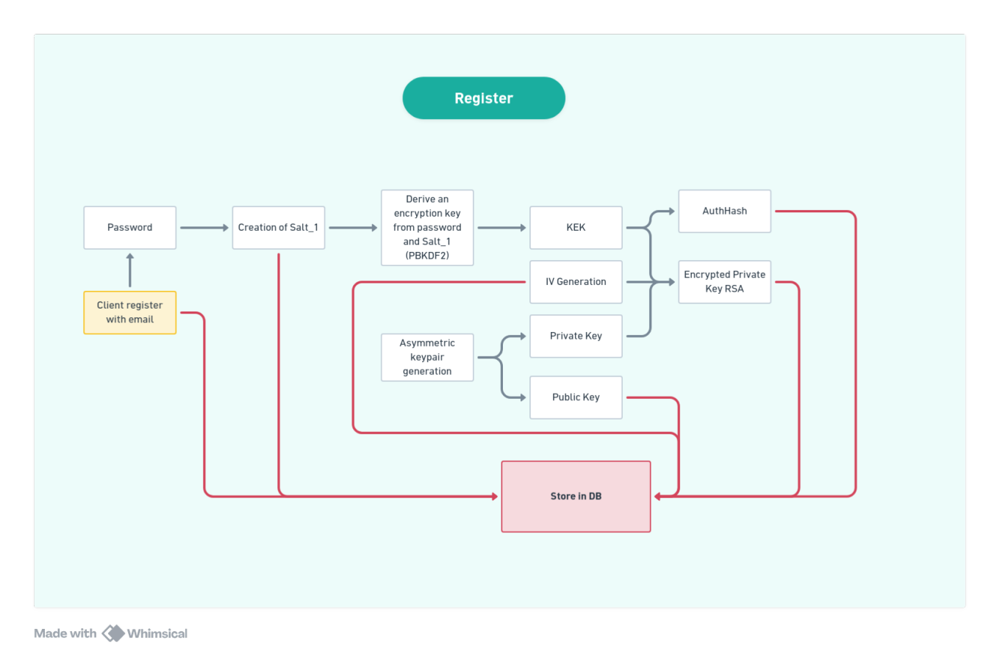
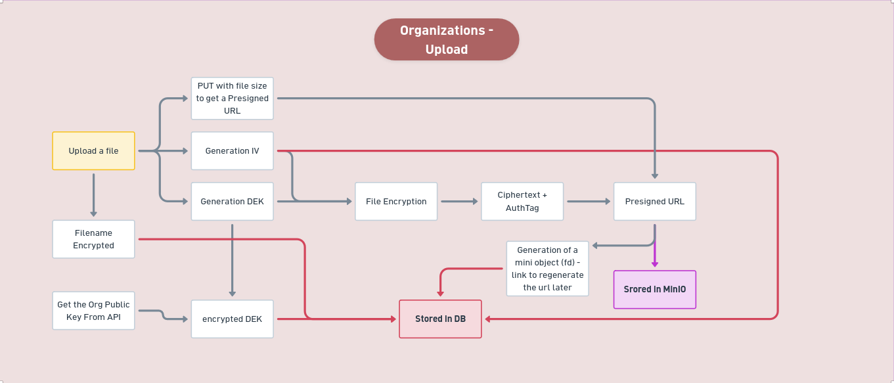

# Workflow d'encryption

## Phases

### Phase 1: Registration Pipeline Cryptographic Blueprint


```

[Form Submission]
├── 1. crypto.getRandomValues() ──> 16-Byte Cryptographic Salt
├── 2. PBKDF2 (100k Iterations, SHA-256) ──> Master Key (AES-GCM 256-bit)
├── 3. crypto.subtle.generateKey() ──> Asymmetric RSA-OAEP 4096-bit KeyPair
├── 4. crypto.subtle.encrypt(AES-GCM) ──> Wrapped User Private Key + 12-Byte IV
├── 5. crypto.subtle.sign(HMAC-SHA256) over "auth_string" ──> AuthHash Proof
└── 6. Base64 Encoding (Chunked 8KB Matrix) ──> POST /api/auth/register

```

#### 1. Low-Level Client Primitives Seeding
Upon triggering `generateRegistrationData(email, password)`, the local browser environment isolates state variables to prevent plain text extraction:
* **Salt Allocation:** A deterministic `Uint8Array` byte structure of 16 bytes (128 bits) is created and mutated via `crypto.getRandomValues(salt)`, filling the vector index placeholders with uniform entropy bytes ranging from 0 to 255.
* **Key Derivation (KDF):** The plain text password is serialized to binary data via a `TextEncoder` abstraction. The engine runs a secure structural key derivation iteration:
   * Master_Key = PBKDF2(Password_bytes, Salt, iterations=100000, hash="SHA-256")
* The returned `CryptoKey` reference points to an extractable symmetric **AES-GCM 256-bit** implementation layer.

#### 2. KeyPair Allocation & Relational Wrapping
* **Asymmetric Infrastructure:** React calls `generateRSAKeyPair()` to allocate an asymmetric **RSA-OAEP 4096-bit** relationship constraint using the standard public exponent parameters ($65537$, encoded as `[1, 0, 1]`).
* **Symmetric Envelope Encapsulation:** To isolate the critical asymmetric asset before network transport, `wrapPrivateKey` is invoked:
  1. The asymmetric asset is marshaled into raw binary representation using the standard export format `"pkcs8"`.
  2. A random 12-byte (96 bits) hardware-seeded Initialization Vector (`iv`) is generated.
  3. The raw private key byte-stream is encrypted symmetrically via **AES-GCM**:
      * encryptedPrivateKey = Encrypt_AES-GCM(PrivateKey_pkcs8, Master_Key, iv)

#### 3. Mathematical Proof Generation (The AuthHash)
The client must provide structural verification of password authenticity without transferring raw key patterns over the TLS barrier. The client triggers `generateAuthHash(masterKey)`:
1. The derived Master Key is exported to a native binary payload (`"raw"` specification).
2. The browser mounts this raw buffer directly into a transient signing structure using **HMAC** linked with a **SHA-256** hash constraint.
3. The structural cryptographic context signs a fixed validation constant message: `"auth_string"` via `crypto.subtle.sign`.
   * AuthHash = HMAC-SHA256(Master_Key_raw, "auth_string")

#### 4. Transport Mapping & Serialization
To guarantee that high-entropy binary byte streams cross the application boundary without character-set corruption, all blocks are split into chunked arrays ($8\text{ KB}$ segments) and marshaled via `uint8ArrayToBase64` using browser-native `btoa` routines before firing the underlying JSON `POST /api/auth/register`.




---

### Phase 2: Login & Volatile Asset Invalidation

**Prerequisite State Constraint:** The application window has been completely recycled. The operational volatile state engine (RAM) contains zero temporary variables. The client context holds no resident operational secret vectors.

#### 1. Asynchronous Salt Retrieval Handshake
The user populates input text vectors inside the React DOM context interface.
* The frontend initializes a network query containing the plain text email identifier payload: `POST /api/auth/salt`.
* **Database Interception:** The Go API processes the input key index, queries PostgreSQL, and extracts the record's raw `salt` block. If the identity exists, it reflects the block to the user context as an opaque Base64 response parameter.

#### 2. Dynamic Symmetric Reconstruction
React ingests the Base64 block string, processes it via `base64ToUint8Array`, and triggers the underlying client pipeline directly matching the registration sequence:
1. Re-executes `deriveMasterKey` with the input password and the recovered server-side salt payload, generating an identical local instance of the **Master Key** structure.
2. Re-runs `generateAuthHash(masterKey)`, signing the explicit static constant `"auth_string"` to output a fresh verification proof signature.
3. Fires a `POST /api/auth/login` containing the `auth_hash` string block.

#### 3. Zero-Knowledge Clearance & Asset Unwrapping
The Go API validates the matching proof payload against the non-reversible database record signature processed under **Argon2id** constraints. Upon success, the session cookies are set, and the user's specific relational payload variables (`encrypted_private_key`, `iv`) are passed back inside the `200 OK` header block.

The React engine captures the payload response and unrolls the envelope using `unwrapPrivateKey`:
1. The network strings are downsampled to basic byte-stream matrices via `base64ToUint8Array`.
2. The runtime invokes `crypto.subtle.decrypt` using **AES-GCM** backed by the freshly reconstructed local Master Key context to resolve the plain text `pkcs8` binary block:
   * decryptedBuffer = Decrypt_AES-GCM(encryptedPrivateKey, Master_Key, iv)
3. The resulting binary block is parsed and mounted into a native asymmetric asset primitive through `crypto.subtle.importKey` under **RSA-OAEP** rules.
4. **Persistent Secure Seeding:** The fully unencrypted operational asset is passed to `storePrivateKey(privateKey)`, committing it directly to **IndexedDB** (`idb.service`) to handle runtime file key decryption operations asynchronously.
5. **Memory Sanitization:** The transient Master Key structural parameters are discarded from the browser's active scope layer, rendering client state immune to memory scraping vectors.


---

### Phase 3 : Upload


### Phase 4 : Download


---

### Organisations

#### 1 Organization Creation Workflow


```

[React Client]
├── 1. Generates Org RSA KeyPair & Temporary AES-256 Key
├── 2. Encrypts Org_Priv_Key with AES Key (AES-GCM)
├── 3. Encrypts AES Key with Admin Public Key (RSA-OAEP)
└── 4. POST /api/orgs ──> [Go / Fiber Backend] ──> [PostgreSQL]

```

1. **Trigger & Primitives Generation:**
   The user initiates the creation sequence. The React frontend uses the Web Crypto API to generate:
   * **Organization Identity:** An asymmetric RSA key pair (`Org_Pub_Key` and `Org_Priv_Key`).
   * **Transient Wrapping Key:** A temporary symmetric `AES-GCM 256` key.

2. **Symmetric Layer (Private Key Protection):**
   The client encrypts the organization's private key using the transient AES key:
   enc_org_priv_key = Encrypt_AES-GCM(Org_Priv_Key, AES_Key)
   * This outputs the `enc_org_priv_key` binary payload along with its unique Initialization Vector (`iv`).

3. **Asymmetric Layer (Key Encapsulation):**
   The client retrieves the Admin's personal public RSA key from the session. The transient AES key is exported to raw bytes and encrypted:
   enc_aes_key = Encrypt_RSA-OAEP(AES_Key_raw, Admin_Pub_Key)

4. **API ingestion & Persistence:**
   All binary buffers are encoded to Base64 strings. The client performs a `POST /api/orgs` request.
   The **Go / Fiber** backend opens a PostgreSQL transaction to:
   * Create the organization row (assigning a standard `UUID`).
   * Add the creator as an **Admin** in the `org_members` junction table.
   * Store `enc_org_priv_key`, `enc_aes_key`, and `iv` directly in the admin's relation row.
   * *Zero-Knowledge Architecture:* The server has no access to plaintext keys and only stores opaque blocks.

5. **Real-Time Notification:** The backend publishes an `org_created` event to **Redis**, broadcasting a WebSocket notification to the user's other active devices to update the UI reactively.

---

#### 2 Member Invitation Flow

**Scenario:** Alice (Admin) invites Bob (New Member) into the organization.


1. **Public Key Retrieval:**
   Alice's React client requests Bob's verified asymmetric `Bob_Pub_Key` from the Go API.

2. **Decryption Phase (Admin Client-Side RAM):**
   Alice's client downloads her own organization cryptographic assets. It decrypts `enc_aes_key` using Alice's hardware/browser-bound private RSA key, then uses the recovered AES key and `iv` to decrypt `enc_org_priv_key`.
   *The `Org_Priv_Key` is now available as a plaintext primitive inside Alice's client volatile memory (RAM).*

3. **Secure Re-Wrapping for the Invitee:**
   To securely pass the key to Bob without the server intercepting it, Alice's client performs a new Key Encapsulation Mechanism (KEM):
   * Generates a **brand new temporary symmetric key** (`Bob_Temp_AES_Key`) and a fresh `iv`.
   * Encrypts the `Org_Priv_Key` with this new symmetric key.
   * Encrypts ("wraps") this new symmetric key using **Bob's Public Key** (`Bob_Pub_Key`) via RSA-OAEP.

4. **Payload Storage:**
   Alice sends these new specific Base64 blobs to the backend via `POST /api/orgs/{id}/members`. The Fiber backend inserts this record into the `org_members` table for Bob. 
   *Result:* Bob now has secure mathematical access to the organization. When he connects, his client will pull his specific blobs and decrypt them using his own private RSA key.


#### 3 Secure Upload & Download Flows




---

