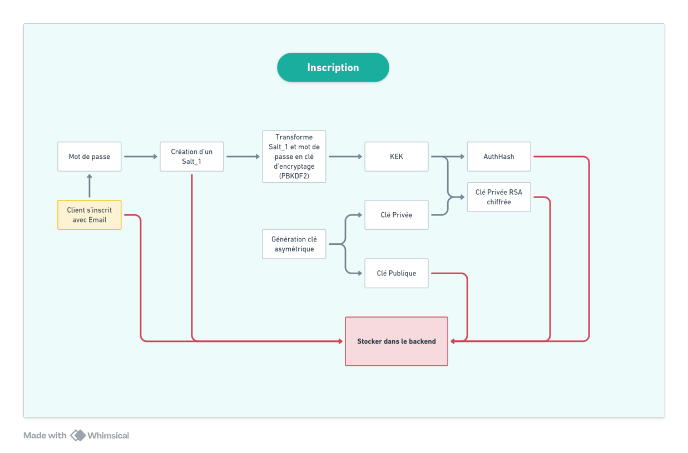
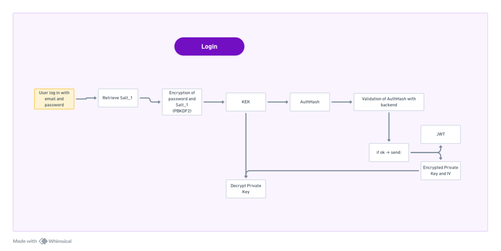
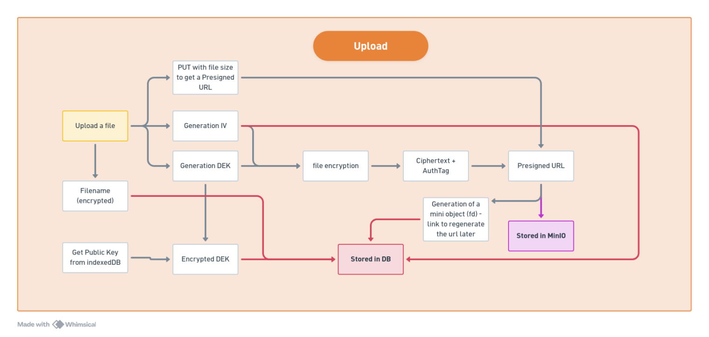
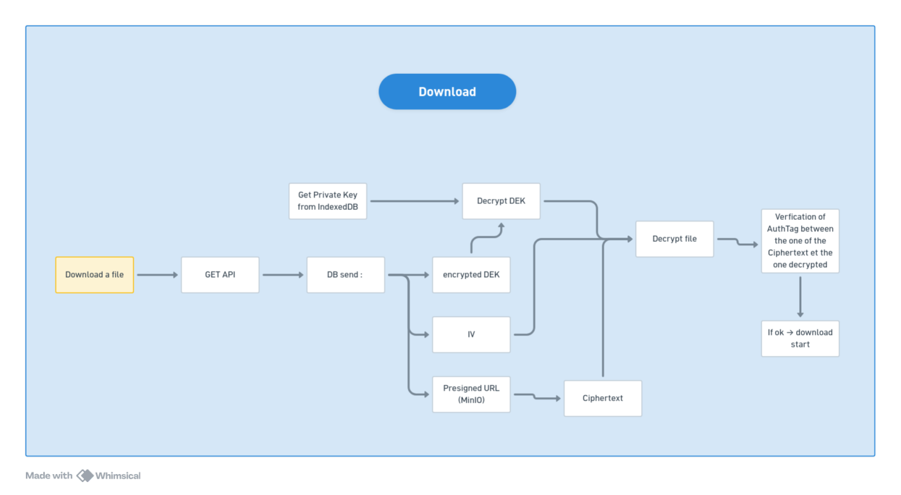
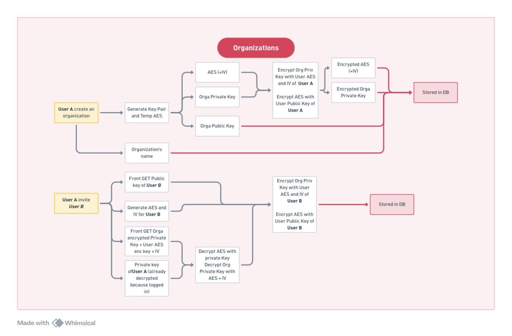
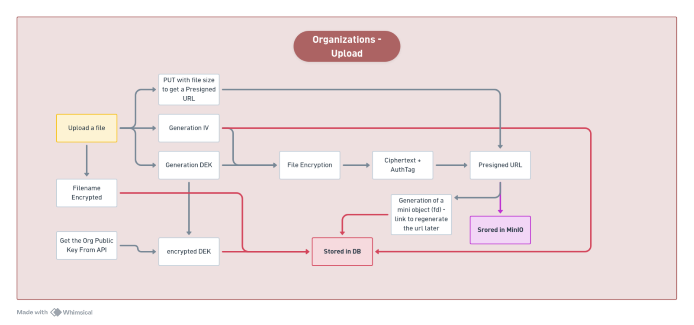
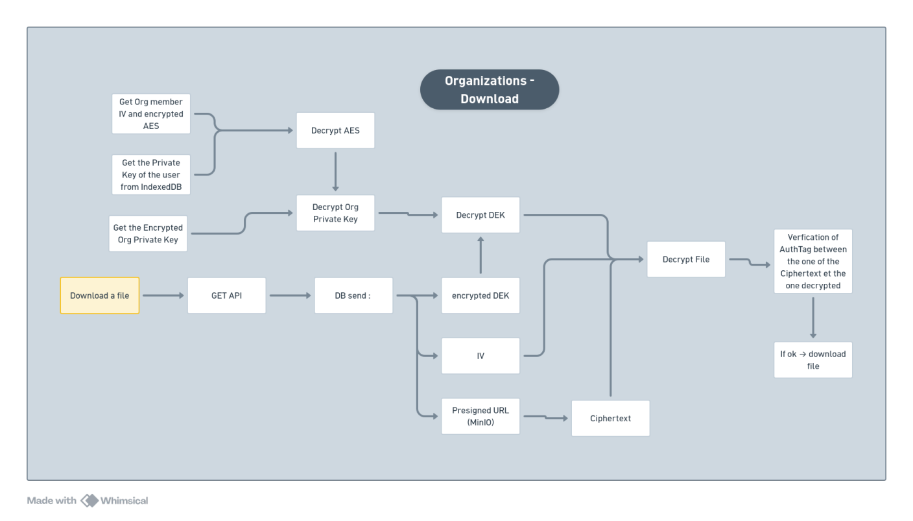

# Workflow d'encryption

## Phases

### Phase 1 : L'Inscription

    Génération de l'entropie : L'utilisateur tape son mot de passe. React utilise crypto.getRandomValues() pour créer un nouveau Salt_1 unique (ex: 16 ou 32 bytes).

    Dérivation (KDF) : React passe le Mot de Passe et le Salt_1 dans PBKDF2.

        Résultat : La Master Key (ou KEK - Key Encryption Key).

    Paires de Clés : React génère la paire asymétrique (Clé Publique / Clé Privée RSA-OAEP 4096-bit).

    Enveloppement (Key Wrapping) : React utilise la Master Key pour chiffrer la Clé Privée (via AES-GCM).

        Résultat : Encrypted_Private_Key.

    Génération du AuthHash : Pour prouver au serveur qu'on connaît le mot de passe sans l'envoyer, React dérive la Master Key une seconde fois : AuthHash = HMAC-SHA256(Master_Key, "auth_string").

    Sauvegarde Backend : React envoie à l'API Go (POST /register) : le Salt_1 (en clair), la Public_Key (en clair), la Encrypted_Private_Key, et le AuthHash.

        Action côté Go : L'API hache le AuthHash (avec bcrypt ou Argon2id) et sauvegarde l'utilisateur dans PostgreSQL.




        

### Phase 2 : Le Login

Le navigateur a été fermé. La RAM est vide. Le client ne possède plus aucune clé.

    Initiation : L'utilisateur tape son email et son mot de passe.

    Fetch du Sel : Le frontend demande au backend Go : "Donne-moi le Salt_1 de cet email".

    Récupération : PostgreSQL renvoie le Salt_1 (qui a été généré lors de l'inscription).

    Re-Calcul : En local, React repasse le mot de passe saisi et le Salt_1 récupéré dans la KDF. Puisque les deux entrées sont identiques à celles de l'inscription, le calcul mathématique retombe exactement sur la même Master Key.

    Authentification : React recalcule le AuthHash et l'envoie au backend (POST /login). L'API Go valide la correspondance et renvoie un JWT ainsi que la Encrypted_Private_Key.

    Déchiffrement local : React utilise la Master Key fraîchement recalculée pour déchiffrer la Encrypted_Private_Key.



### Phase 3 : L'Upload (Chiffrement Hybride par Fichier)

    Génération de la DEK : Dès que l'utilisateur sélectionne un fichier, la Web Crypto API génère une clé symétrique aléatoire, strictement unique à ce fichier : la DEK (Data Encryption Key, AES-GCM 256-bit).

    Génération de l'IV : Création d'un Vecteur d'Initialisation (Initialization Vector) aléatoire de 12 bytes.

    Chiffrement du Fichier : Le contenu brut (plaintext) passe dans AES-GCM avec la DEK et l'IV.

        Résultat : Le Ciphertext (blob illisible). Note d'implémentation : en Web Crypto, l'Auth Tag (MAC) n'est pas séparé, il est automatiquement concaténé à la fin du Ciphertext par l'API.

    Protection de la DEK : Le frontend récupère la Clé Publique de l'utilisateur (depuis l'API ou le store local). Il l'utilise pour chiffrer la DEK via RSA-OAEP.

        Résultat : Encrypted_DEK.

    Routage des données :

        Vers Go (PostgreSQL) : React envoie les métadonnées : nom du fichier, Encrypted_DEK et IV.

        Vers MinIO : React envoie le Ciphertext (le blob) directement via la Presigned URL.



### Phase 4 : Le Download (Le Déchiffrement E2EE)

    Requête de métadonnées : React fait un GET sur l'API Go. Le backend interroge PostgreSQL et renvoie : la Encrypted_DEK, l'IV et l'URL présignée MinIO.

    Unwrapping de la DEK : Le frontend récupère la Clé Privée de l'utilisateur depuis Zustand. Il déchiffre la Encrypted_DEK.

        Résultat : La DEK est de retour en clair dans la RAM du navigateur.

    Téléchargement du Blob : React télécharge le Ciphertext depuis MinIO.

    Déchiffrement Final : Le frontend injecte dans crypto.subtle.decrypt : la DEK, l'IV, et le Blob.

        Intégrité : L'algorithme vérifie silencieusement l'Auth Tag inclus dans le blob. Si le hash correspond, il recrache le fichier original. Si un attaquant a modifié un bit sur MinIO, la fonction throw une erreur et refuse de déchiffrer.



---

### Organisations

1. Création de l'Organisation

Lorsqu'un utilisateur (l'Admin) crée une organisation depuis le frontend React :


    Génération : React génère une nouvelle paire de clés dédiée à l'organisation (ex: Org_Pub_Key et Org_Priv_Key).

    React chiffre la Org_Priv_Key en utilisant la Public_Key de l'Admin.

   Le frontend envoie à Fiber : le nom de l'orga, la Org_Pub_Key (en clair), et la Encrypted_Org_Priv_Key (chiffrée pour l'Admin).
2. L'Invitation d'un Membre

    Le frontend d'Alice(admin) télécharge la Public_Key de Bob depuis l'API Go.

    Le frontend d'Alice déchiffre la Encrypted_Org_Priv_Key (qu'elle re-déchiffre via sa propre clé privée). L'Org_Priv_Key est maintenant en clair dans la RAM d'Alice.

    Alice chiffre cette Org_Priv_Key avec la Public_Key de Bob.

    Alice envoie ce nouveau blob au backend  Fiber l'insère dans la base de données. Bob possède désormais un accès mathématique à l'organisation. dechiffre grace a la private key de lui meme


3. Upload et Download dans l'Organisation

    Upload : Lorsqu'un membre upload un fichier dans l'espace de l'organisation, React génère la DEK du fichier, chiffre le fichier, puis chiffre la DEK avec la Org_Pub_Key.

    Download : N'importe quel membre récupère la DEK chiffrée. Il déchiffre d'abord son accès à l'organisation (Encrypted_Org_Priv_Key locale -> Org_Priv_Key), puis utilise l'Org_Priv_Key pour déchiffrer la DEK du fichier.



---

## Définition

- entropie
    - Génération de mot de passe / clé au hasard
- Salt_1
    - une chaîne aléatoire qui est combinée avec un mot de passe avant de calculer son hash
    ```
    mot_de_passe = "azerty123"
    salt = "Salt_1"
    hash = hash(mot_de_passe + salt)
    ```
    - unique par utilisateur
    - généré aléatoirement
    - peut être stocké en clair

- Dérivation (KDF)
    - Key Derivation Function
    - Algorithme qui transforme un mot de passe et un salt en clé d'encryptage
- PBKDF2
    - Password-Based Key Derivation Function 2
    - KDF standardisé
    ```
    clé = PBKDF2(
    mot_de_passe,
    salt,
    nombre_d_iterations,
    fonction_hash
    )
    ```
- KEK
    - Key encryption Key
    - sert à protéger d'autres clés
    ```
    KEK = KDF(
    password,
    salt,
    iterations,
    output_length = 32 bytes
    )
    ```
- Key Wrapping
    - Chiffrer une clé cryptographique avec une autre clé
    - Clé qui protège = KEK 
    - Clé protégée = clé privée RSA
- RSA-OAEP 4096-bit
    - algorithme de cryptographie asymétrique.
    - Clé publique (pour chiffrer)
    - Clé privée (pour déchiffrer)
    - OAEP ajoute : Randomisation et Protection contre certaines attaques
- AES-GCM
    - Advanced Encryption Standard: algorithme de chiffrement symétrique (rapide et moderne) qui utilise une seule clé, est très rapide et est un standard mondial
    - Galois/Counter Mode (GCM): mode de fonctionnement d’AES qui fournit: Confidentialité (chiffrement), Authentification (détection modification), Intégrité
- Encrypted private key
    - clé privée qui a été chiffrée.
    - Private_Key  →  AES-GCM avec KEK  →  Encrypted_Private_Key
- HMAC-SHA256 = Hachage sécurisé basé sur une clé secrète
- AuthHash
    - empreinte cryptographique authentifiée générée à partir d’une clé secrète pour vérifier la bonne valeur du mot de passe
- Au final : 
    - Mot de passe + Salt → PBKDF2 → KEK AES-256-GCM (Key Wrapping) →  Clé Privée RSA chiffrée && AutHash
    - RSA-4096 ==> (Public_Key  → stockée en clair) && (Private_Key → protégée via KEK)
    - Le backend stocke : Encrypted_Private_Key + Public_Key +  Salt + AuthHash
    - Le backend : ne connaît jamais le mot de passe, ni la clé privée et ne peut donc pasdéchiffrer
    -  Architecture "zero knowledge"

---

- JWT
    - JSON Web Token
    - jeton sécurisé utilisé pour authentifier et échanger des informations entre deux parties
    - contient 3 parties séparées par des points : HEADER.PAYLOAD.SIGNATURE
        - Header (en-tête): Indique le type (JWT) et l’algorithme de signature (HS256, RS256, etc.)
        - Payload (corps / claims): Contient les informations à transmettre (claims)
        - Signature: Permet de vérifier que le token n’a pas été modifié

---

- DEK
    - Data Encryption Key
    - chiffre réellement les données
- IV
    - Initialization Vector
    - valeur aléatoire utilisée avec l'algorithme de chiffrement symétrique pour garantir que le même message chiffré plusieurs fois avec la même clé produira des ciphertexts différents
    - rend le chiffrement non déterministe, protégeant contre les attaques par motifs et répétitions
- MinIO
    - stockage objet compatible S3
    - stocker n’importe quelle donnée sous forme d’objet
    - Chaque objet a un nom unique (key) et des métadonnées
- Presigned URL 
    - permet de donner à un client l’accès temporaire à un objet dans MinIO sans partager la clé d’accès globale
- Au final :
    - Upload File → DEK (unique au fichier) & IV → Chiffrement → Ciphertext + Auth Tag (concaténé automatiquement) → Enregistrement dans la DB (nom de fichier, DEK encrypté et IV) & Presigned URL vers MiniIO

---

- E2EE = End-to-End Encryption
    - chiffrement de bout en bout.
    - données sont chiffrées côté émetteur et ne sont déchiffrées que côté destinataire.
- Zustand 
    - bibliothèque JavaScript/React pour la gestion d’état
- Au final :
    - GET (fichier sur API) → backend interroge DB → renvoie DEK encrypté, IV et URL présignée MinIO + front récupère Clé Privée → Déchriffrement de la DEK → front télécharge le Ciphertext → Déchiffrement final (si Auth Tag correspond)

